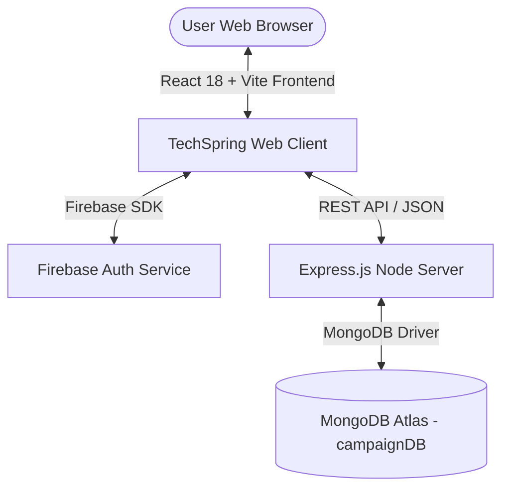

# 🚀 TechSpring - Full-Stack Crowdfunding & Startup Funding Platform

[](https://techspring-ec865.web.app/)
[](https://github.com/AyshaUrmi0/Tech-startup)
[](https://github.com/AyshaUrmi0/TechSpring-Server)
[](https://tech-spring-server.vercel.app/)
[](https://reactjs.org/)
[](https://vitejs.dev/)
[](https://tailwindcss.com/)
[](https://www.mongodb.com/)
[](https://firebase.google.com/)

TechSpring is a full-stack web application designed to empower tech startups, creative innovators, and personal causes to raise funding through community contributions. Built with **React 18**, **Vite**, **Tailwind CSS**, **Node.js/Express**, **MongoDB Atlas**, and **Firebase Authentication**.

---

## 🔗 Repositories & Live Links

- 💻 **Frontend Repository**: [`https://github.com/AyshaUrmi0/Tech-startup`](https://github.com/AyshaUrmi0/Tech-startup)
- ⚙️ **Backend Repository**: [`https://github.com/AyshaUrmi0/TechSpring-Server`](https://github.com/AyshaUrmi0/TechSpring-Server)
- 🌐 **Live Web Application**: [`https://techspring-ec865.web.app/`](https://techspring-ec865.web.app/)
- 📡 **Backend REST API**: [`https://tech-spring-server.vercel.app/`](https://tech-spring-server.vercel.app/)

---

## 🌟 Key Features

- **🔐 Secure Authentication**: Multi-provider login and registration using Firebase Auth (Email/Password & Google OAuth).
- **📊 Complete Campaign CRUD**: Create, explore, update, and delete crowdfunding campaigns.
- **💸 Live Contribution System**: Interactive donation processing linking user accounts to campaigns.
- **🌙 Theme Synchronization & Persistence**: Built-in Light/Dark mode with automatic system preference detection (`prefers-color-scheme`) and `localStorage` state persistence.
- **⚡ Advanced Filtering & Sorting**: Server-side deadline validation (`filterByDate`) and descending minimum donation sorting.
- **📱 Fully Responsive Design**: Mobile-first UI powered by DaisyUI and modern Tailwind CSS tokens.
- **🤖 Automated CI/CD**: Seamless deployment pipeline to Firebase Hosting via GitHub Actions.

---

## 🏗️ System Architecture



---

## 🛠️ Tech Stack

| Domain | Technologies & Libraries | Repository Link |
| :--- | :--- | :--- |
| **Frontend** | React 18, Vite 6, Tailwind CSS, DaisyUI, React Router v6, React Awesome Reveal, Swiper, React Icons, Toastify | [`Tech-startup`](https://github.com/AyshaUrmi0/Tech-startup) |
| **Backend** | Node.js, Express.js, MongoDB Node Driver, CORS, Dotenv, MVC Architecture | [`TechSpring-Server`](https://github.com/AyshaUrmi0/TechSpring-Server) |
| **Authentication** | Firebase Authentication (Web SDK v11) | — |
| **Hosting & CI/CD** | Firebase Hosting (Frontend), Vercel (Backend), GitHub Actions (CI/CD) | — |

---

## 🔌 API Endpoint Documentation

| Method | Endpoint | Description | Access |
| :--- | :--- | :--- | :--- |
| `GET` | `/` | Health check endpoint | Public |
| `GET` | `/addCampaigns` | Fetch all campaigns (supports `sortByDesc`, `filterByDate`, `limitToSix`) | Public |
| `POST` | `/addCampaigns` | Create a new campaign | Authenticated |
| `GET` | `/campaign/:id` | Fetch single campaign details by ID | Public |
| `GET` | `/campaigns/:email` | Fetch all campaigns created by specific user | Authenticated |
| `PUT` | `/campaigns/:id` | Update campaign details by ID | Owner |
| `DELETE` | `/campaign/:id` | Delete campaign by ID | Owner |
| `POST` | `/donations` | Record a new donation | Authenticated |
| `GET` | `/mydonations/emailSpecific/:id` | Fetch user specific donation history | Authenticated |

---

## 💻 Local Development Setup

### 1. Clone the Repository
```bash
git clone https://github.com/AyshaUrmi0/Tech-startup.git
cd Tech-startup
```

### 2. Install Dependencies (Safe Mode)
```bash
npm install --ignore-scripts
```

### 3. Environment Variables Setup
Create a `.env` file in the project root:
```env
VITE_PUBLIC_FIREBASE_API_KEY=your_firebase_api_key
VITE_PUBLIC_FIREBASE_AUTH_DOMAIN=your_firebase_auth_domain
VITE_PUBLIC_FIREBASE_PROJECT_ID=your_firebase_project_id
VITE_PUBLIC_FIREBASE_STORAGE_BUCKET=your_firebase_storage_bucket
VITE_PUBLIC_FIREBASE_MESSAGING_SENDER_ID=your_firebase_messaging_sender_id
VITE_PUBLIC_FIREBASE_APP_ID=your_firebase_app_id
```

### 4. Run Development Server
```bash
npm run dev
```

---

## 📄 License

This project is licensed under the MIT License - see the [LICENSE](LICENSE) file for details.
